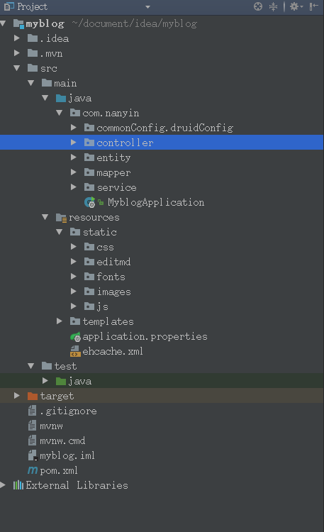
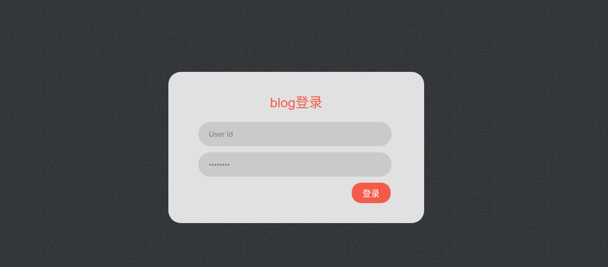
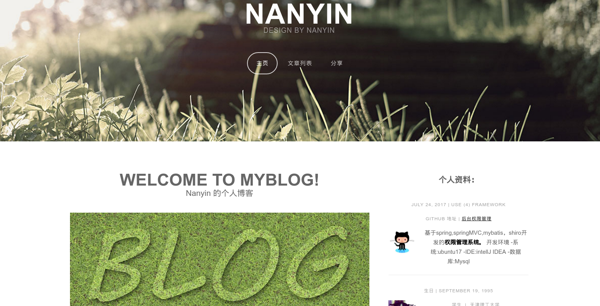
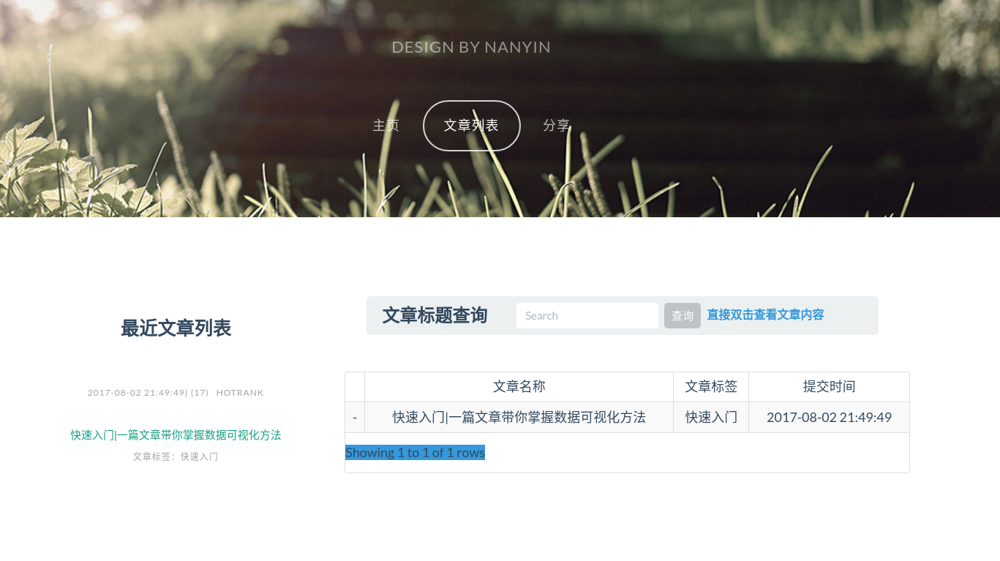
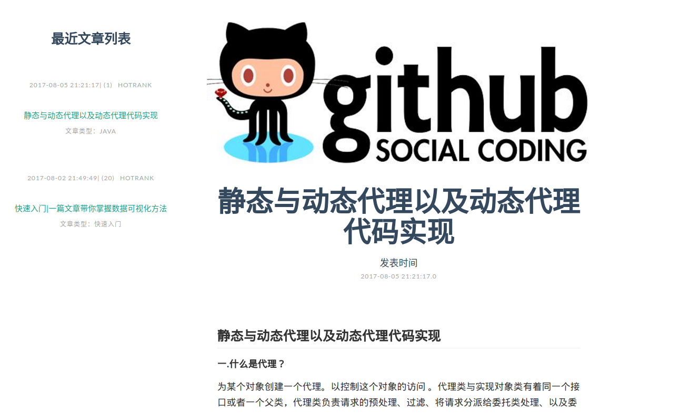
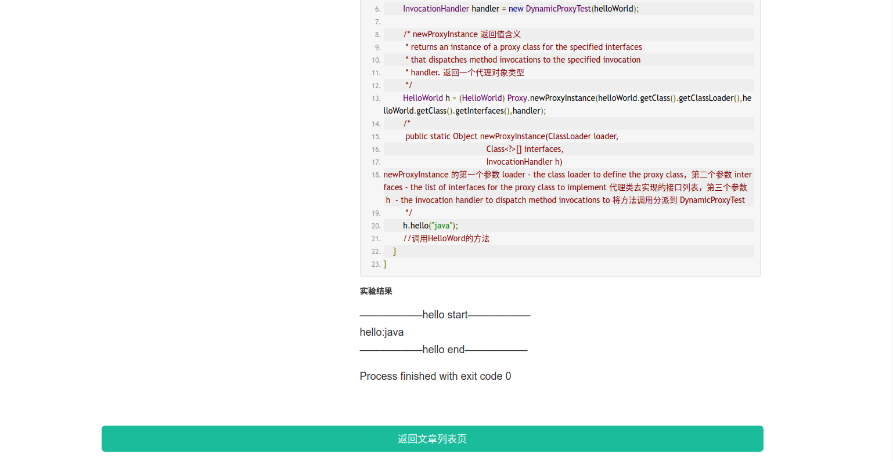
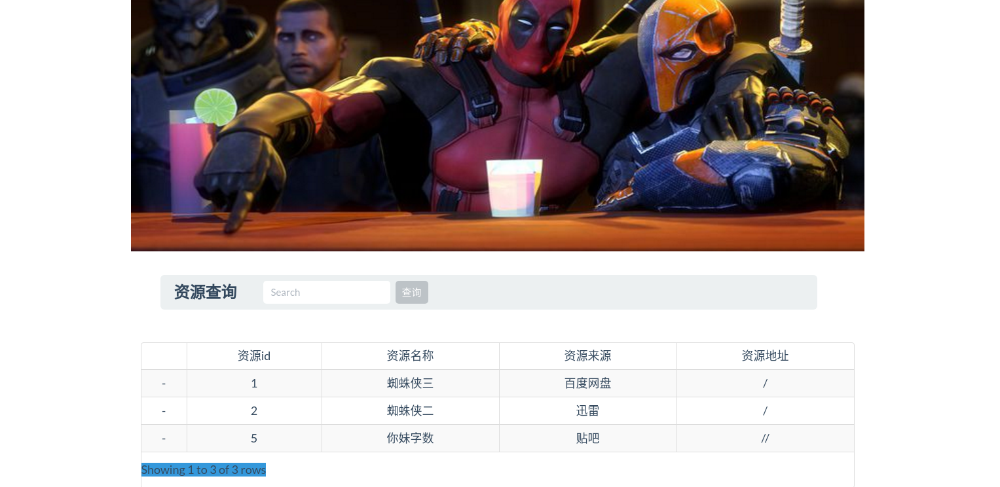
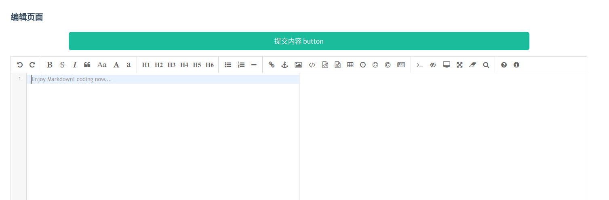
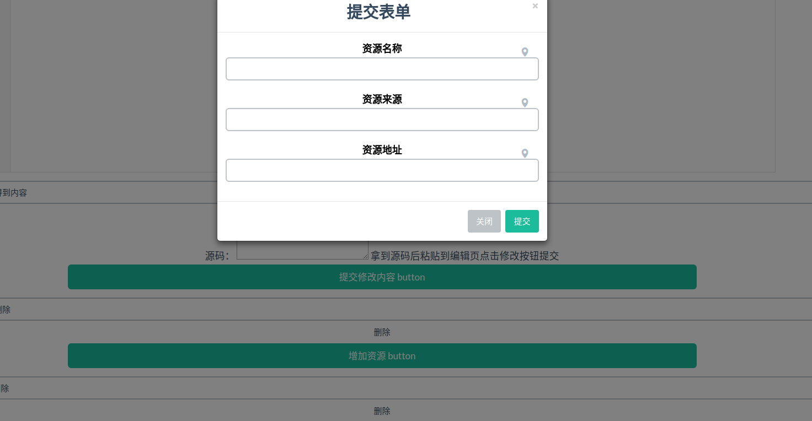

# myblog Java博客系统
blog system 实现编写博客和分享资源的目的 使用markdown编辑器使对技术博客的支持更加出色。 以下是技术特点：
#### 使用框架
springboot实现快速开发 集成ORM框架:mybatis   
### 开发环境
-系统:ubuntu17
-IDE:intellJ IDEA
-数据库:Mysql
-应用服务器:tomcat
-数据库客户端:DBeaver
-jdk版本:jdk8
### 预览图
#### 目录结构

#### 登录

#### INDEX 主页
 
#### 文章列表

#### 文章显示

#### 分享

#### 编辑

